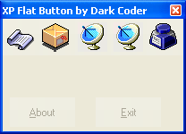



## XP Flat Button

### Description

I was looking for a flat toolbar style xp button on psc, but i couldnt find one - there was some great stuff by AKI but no efficent xp toolbar buttons. So i wipped one together in about 15 minutes - PLEASE VOTE!
 
### More Info
 

             |
---                |---
**Submitted On**   |2002-10-19 11:30:28
**By**             |[Dark Coder](https://github.com/Planet-Source-Code/PSCIndex/blob/master/ByAuthor/dark-coder.md)
**Level**          |Intermediate
**User Rating**    |4.2 (25 globes from 6 users)
**Compatibility**  |VB 5\.0, VB 6\.0
**Category**       |[Custom Controls/ Forms/  Menus](https://github.com/Planet-Source-Code/PSCIndex/blob/master/ByCategory/custom-controls-forms-menus__1-4.md)
**World**          |[Visual Basic](https://github.com/Planet-Source-Code/PSCIndex/blob/master/ByWorld/visual-basic.md)
**Archive File**   |[XP\_Flat\_Bu14844810202002\.zip](https://github.com/Planet-Source-Code/dark-coder-xp-flat-button__1-40004/archive/master.zip)

